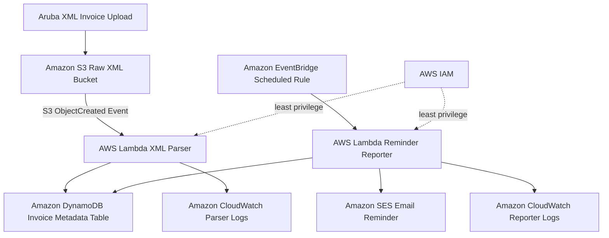

# Architecture Diagram

```mermaid
flowchart TD
    A[Aruba XML Invoice Upload] --> B[Amazon S3 Raw XML Bucket]
    B -->|S3 ObjectCreated Event| C[AWS Lambda XML Parser]
    C --> D[Amazon DynamoDB Invoice Metadata Table]
    C --> E[Amazon CloudWatch Parser Logs]
    F[Amazon EventBridge Scheduled Rule] --> G[AWS Lambda Reminder Reporter]
    G --> D
    G --> H[Amazon SES Email Reminder]
    G --> I[Amazon CloudWatch Reporter Logs]
    J[AWS IAM] -. least privilege .-> C
    J -. least privilege .-> G
```
