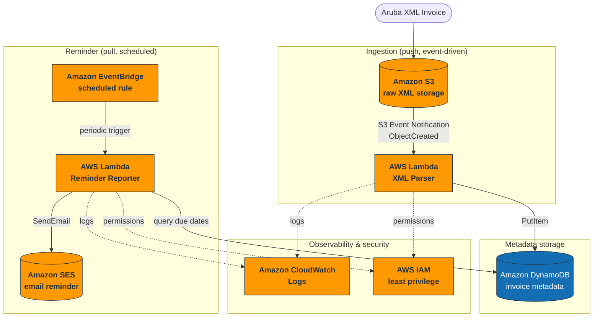
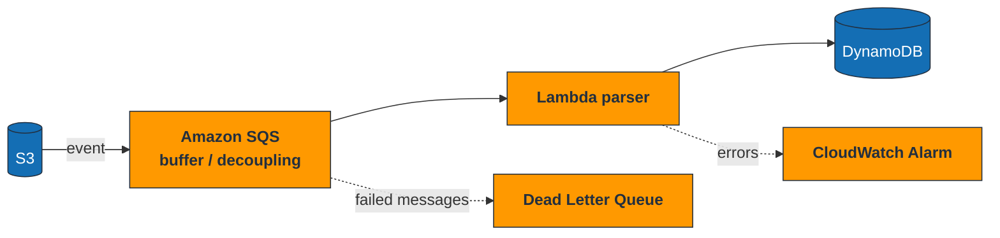

# Architecture Diagram

Serverless, event-driven pipeline. Two independent triggers: an **S3 event**
(push) for ingestion and an **EventBridge schedule** (pull) for reminders. The two
phases are decoupled and only share state through DynamoDB.



## Proposed evolution (future improvements)

Adding **SQS between S3 and Lambda** introduces a buffer that absorbs upload
spikes and decouples producer from consumer; a **Dead Letter Queue** captures
messages that fail parsing instead of losing them. CloudWatch alarms on Lambda
errors surface failures early.



## Text fallback

For environments that do not render Mermaid:

```text
Aruba XML Files
        ↓
Amazon S3
        ↓ (ObjectCreated trigger)
AWS Lambda - XML Parser
        ↓
Amazon DynamoDB
        ↓ (scheduled execution)
Amazon EventBridge
        ↓
AWS Lambda - Reporting
        ↓
Amazon SES
        ↓
Email Reminder Report
```
